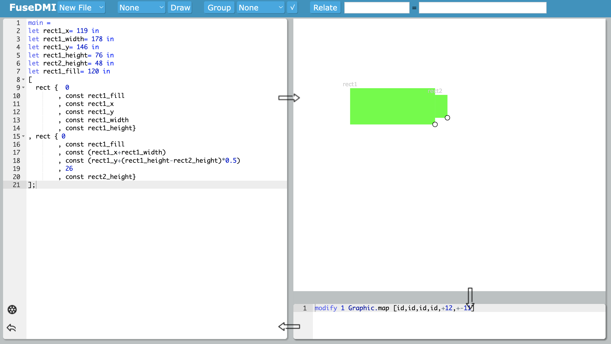

# FuseDMI: Manipulation-directed Bidirectional Live Programming for SVG

## How to run the system
- 1. compile elm to js, then serve `index.html`: 
    + compile by: `./compile.sh`
    + serve by web-server such as `http-server`
- 2. live running:  `elm reactor --port=8001`, default port is `8000`, which is also OK.
    + or run by : `./serve.sh`

## Benchmark Examples

All examples are under `src/Examples` folder, in addition, two step-by-step demos are under `src/Demos`.

