## Steps for buiding the Balance Scale

1. Draw an ellipse. 
```
main = [ ellipse { 0, 211, 306, 378, 100, 18}];
```
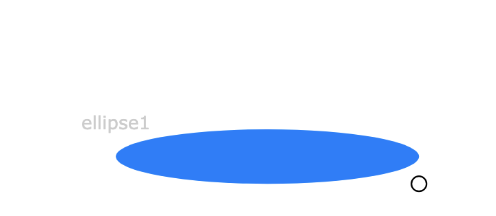

2. Draw the middle line. 
 ```
 main = 
[
  ellipse { 0, 211, 306, 378, 100, 18}, 
  line { 0, 0, 300, 189, 301, 363}
];
```
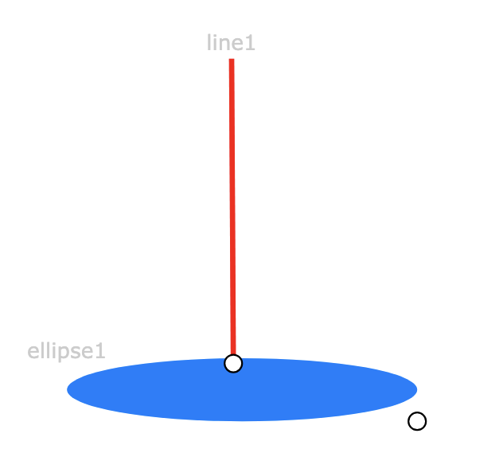

3. Revise the code. Since the line is not straight enough, which is hard to adjust in SVG, we can manully change `301` to `300` in the code.
 ```
 main = 
[
  ellipse { 0, 211, 306, 378, 100, 18}, 
  line { 0, 0, 300, 189, 300, 363}
];
```

4. Refact the code. Since the middle of the ellipse should be the bottom of the middle line. We abstract the `x` of the middle line as a variable `middle_line_x`, and set the ellipse's center point'x  as `middle_line_x`.

```
main = 
let *middle_line_x = 300 in
[
  ellipse { 0, 211, *middle_line_x, 378, 100, 18}, 
  line { 0, 0, const *middle_line_x, 189, const *middle_line_x, 363}
];
```
5. Draw the left line, and drag the left line to align with the middle line.
```
main = 
let *middle_line_x = 300 in
[
  ellipse { 0, 211, *middle_line_x, 378, 100, 18} 
, line { 0, 0, const *middle_line_x, 189, const *middle_line_x, 363}
, line { 0, 0, 300, 189, 216, 235}];
```
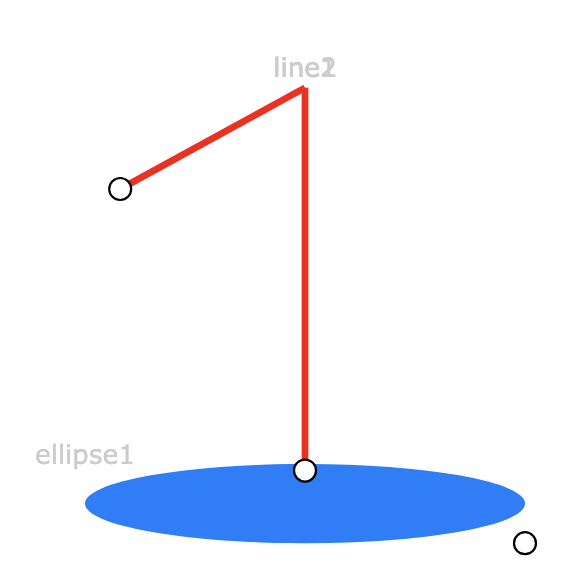

6. Refactor: Build the relationship with the middle line. 
```
main = 
let *middle_line_x = 300 in
let *middle_line_y1 = 189 in
[
  ellipse { 0, 211, 306, 378, 100, 18} 
, line { 0, 0, const *middle_line_x, const *middle_line_y1, const *middle_line_x, 363}
, line { 0, 0, const *middle_line_x, const *middle_line_y1, 216, 235}];
```
7. Draw the right line, and drag the right line to align with the middle line.

```
main = 
let *middle_line_x = 300 in
let *middle_line_y1 = 189 in
[
  ellipse { 0, 211, 306, 378, 100, 18}, 
  line { 0, 0, const *middle_line_x, const *middle_line_y1, const *middle_line_x, 363}, 
  line { 0, 0, const *middle_line_x, const *middle_line_y1, 216, 235}, 
  line { 0, 0, 299, 189, 378, 244}];
```
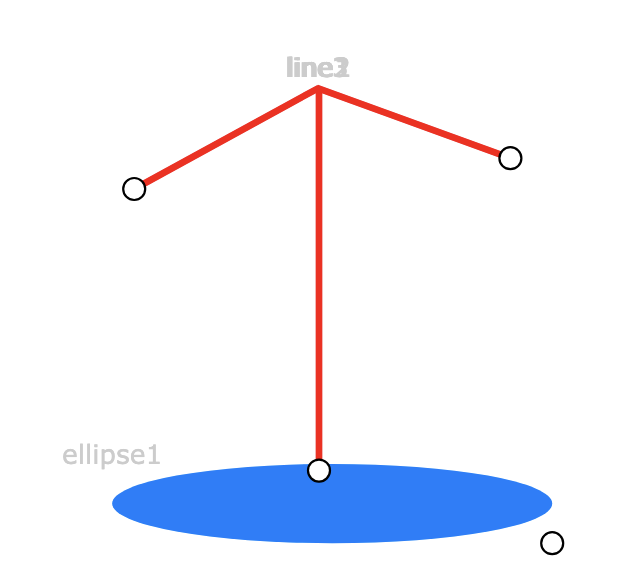

8. Refactor: Build the relationship with the middle line.
```
main = 
let *middle_line_x = 300 in
let *middle_line_y1 = 189 in
[
  ellipse { 0, 211, 306, 378, 100, 18} 
, line { 0, 0, const *middle_line_x, const *middle_line_y1, const *middle_line_x, 363}
, line { 0, 0, const *middle_line_x, const *middle_line_y1, 216, 235}
, line { 0, 0, const *middle_line_x, const *middle_line_y1, 378, 244}
];
```

9. Add the left-Left line.
```
main = 
let *middle_line_x = 300 in
let *middle_line_y1 = 189 in
[
  ellipse { 0, 211, 306, 378, 100, 18} 
, line { 0, 0, const *middle_line_x, const *middle_line_y1, const *middle_line_x, 363}
, line { 0, 0, const *middle_line_x, const *middle_line_y1, 216, 235}
, line { 0, 0, const *middle_line_x, const *middle_line_y1, 378, 244}
, line { 0, 0, 216, 235, 173, 277}];
```
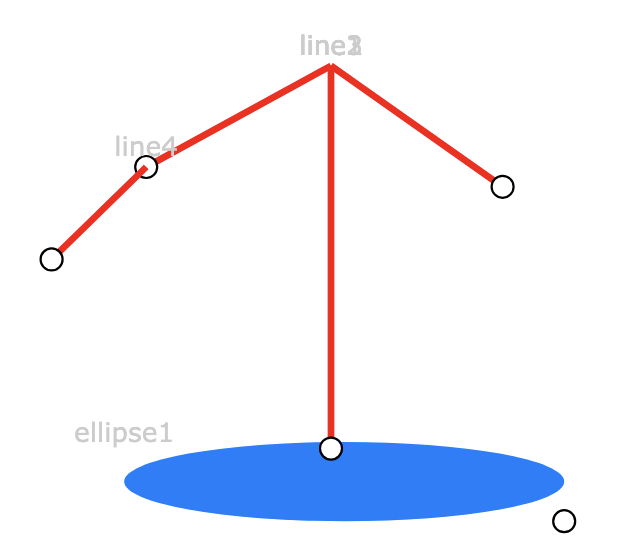

10. Refactor

```
main = 
let *middle_line_x = 300 in
let *middle_line_y1 = 189 in
let *left_line_x2 = 216 in  
let *left_line_y2 = 235 in  
[
  ellipse { 0, 211, 306, 378, 100, 18} 
, line { 0, 0, const *middle_line_x, const *middle_line_y1, const *middle_line_x, 363}
, line { 0, 0, const *middle_line_x, const *middle_line_y1, *left_line_x2, *left_line_y2}
, line { 0, 0, const *middle_line_x, const *middle_line_y1, 378, 244}
, line { 0, 0, *left_line_x2, *left_line_y2, 173, 277}];
```

11. Add the left-right line.

```
main = 
let *middle_line_x = 300 in
let *middle_line_y1 = 189 in
let *left_line_x2 = 216 in  
let *left_line_y2 = 235 in  
[
  ellipse { 0, 211, 306, 378, 100, 18}, 
  line { 0, 0, const *middle_line_x, const *middle_line_y1, const *middle_line_x, 363}, 
  line { 0, 0, const *middle_line_x, const *middle_line_y1, *left_line_x2, *left_line_y2}, 
  line { 0, 0, const *middle_line_x, const *middle_line_y1, 378, 244}, 
  line { 0, 0, *left_line_x2, *left_line_y2, 173, 277},
  line { 0, 0, 217, 235, 251, 280}];
```
 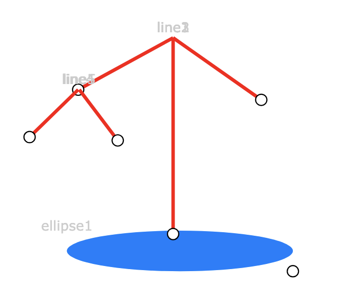 

12. Refactor 
```
main = 
let *middle_line_x = 300 in
let *middle_line_y1 = 189 in
let *left_line_x2 = 216 in 
let *left_line_y2 = 235 in
let *left_twoline2_y = 277 in
[
  ellipse { 0, 211, 306, 378, 100, 18} 
, line { 0, 0, const *middle_line_x, const *middle_line_y1, const *middle_line_x, 363}
, line { 0, 0, const *middle_line_x, const *middle_line_y1, const *left_line_x2, const *left_line_y2}
, line { 0, 0, const *middle_line_x, const *middle_line_y1, 378, 244}
, line { 0, 0, const *left_line_x2, const *left_line_y2, 173, const *left_twoline2_y}
, line { 0, 0, const *left_line_x2, const *left_line_y2, 241, const *left_twoline2_y}
];
```

13. Add the left ellipse.
```
main = 
let *middle_line_x = 300 in
let *middle_line_y1 = 189 in
let *left_line_x2 = 216 in 
let *left_line_y2 = 235 in
let *left_twoline2_y = 277 in
[
  ellipse { 0, 211, 306, 378, 100, 18} 
, line { 0, 0, const *middle_line_x, const *middle_line_y1, const *middle_line_x, 363}
, line { 0, 0, const *middle_line_x, const *middle_line_y1, const *left_line_x2, const *left_line_y2}
, line { 0, 0, const *middle_line_x, const *middle_line_y1, 378, 244}
, line { 0, 0, const *left_line_x2, const *left_line_y2, 173, const *left_twoline2_y}
, line { 0, 0, const *left_line_x2, const *left_line_y2, 241, const *left_twoline2_y}
, ellipse { 0, 0, 210, 280, 47, 8}];
```
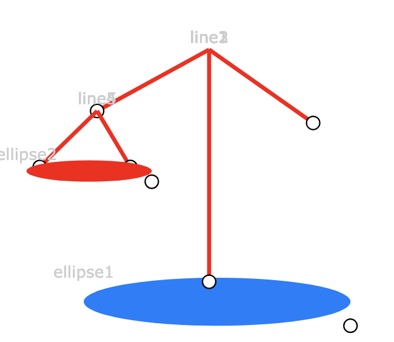


14. Refactor 
```
main = 
let *middle_line_x = 300 in
let *middle_line_y1 = 189 in
let *left_line_x2 = 216 in 
let *left_line_y2 = 235 in
let *left_twoline2_y = 280 in
let *left_ellipse_cx = 210 in
let *ellipse_rx = 47 in 
let *ellipse_ry = 8 in
[
  ellipse { 0, 211, 306, 378, 100, 18} 
, line { 0, 0, const *middle_line_x, const *middle_line_y1, const *middle_line_x, 363}
, line { 0, 0, const *middle_line_x, const *middle_line_y1, const *left_line_x2, const *left_line_y2}
, line { 0, 0, const *middle_line_x, const *middle_line_y1, 378, 244}
, line { 0, 0, const *left_line_x2, const *left_line_y2, const (*left_ellipse_cx-*ellipse_rx), const *left_twoline2_y}
, line { 0, 0, const *left_line_x2, const *left_line_y2, const (*left_ellipse_cx+*ellipse_rx), const *left_twoline2_y}
, ellipse { 0, 0, const *left_ellipse_cx, const *left_twoline2_y, const *ellipse_rx, const *ellipse_ry}
];
```

15. Add the right-left line.

```
main = 
let *middle_line_x = 300 in
let *middle_line_y1 = 189 in
let *left_line_x2 = 216 in 
let *left_line_y2 = 235 in
let *left_twoline2_y = 280 in
let *left_ellipse_cx = 210 in
let *ellipse_rx = 47 in 
let *ellipse_ry = 8 in
[
  ellipse { 0, 211, 306, 378, 100, 18} 
, line { 0, 0, const *middle_line_x, const *middle_line_y1, const *middle_line_x, 363}
, line { 0, 0, const *middle_line_x, const *middle_line_y1, const *left_line_x2, const *left_line_y2}
, line { 0, 0, const *middle_line_x, const *middle_line_y1, 378, 244}
, line { 0, 0, const *left_line_x2, const *left_line_y2, const (*left_ellipse_cx-*ellipse_rx), const *left_twoline2_y}
, line { 0, 0, const *left_line_x2, const *left_line_y2, const (*left_ellipse_cx+*ellipse_rx), const *left_twoline2_y}
, ellipse { 0, 0, const *left_ellipse_cx, const *left_twoline2_y, const *ellipse_rx, const *ellipse_ry}
, line { 0, 0, 377, 243, 343, 277}];
```
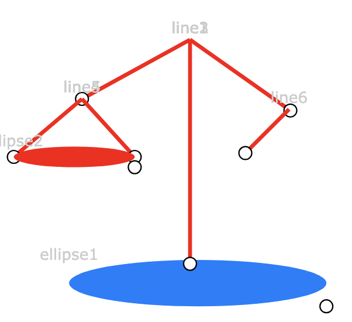

16. Refactor 
    
```
main = 
let *middle_line_x = 300 in
let *middle_line_y1 = 189 in
let *left_line_x2 = 216 in 
let *left_line_y2 = 235 in
let *left_twoline2_y = 280 in
let *left_ellipse_cx = 210 in
let *ellipse_rx = 47 in 
let *ellipse_ry = 8 in
let *right_line_x2 = 378 in 
let *right_line_y2 = 244 in
[
  ellipse { 0, 211, 306, 378, 100, 18} 
, line { 0, 0, const *middle_line_x, const *middle_line_y1, const *middle_line_x, 363}
, line { 0, 0, const *middle_line_x, const *middle_line_y1, const *left_line_x2, const *left_line_y2}
, line { 0, 0, const *middle_line_x, const *middle_line_y1, *right_line_x2, *right_line_y2}
, line { 0, 0, const *left_line_x2, const *left_line_y2, const (*left_ellipse_cx-*ellipse_rx), const *left_twoline2_y}
, line { 0, 0, const *left_line_x2, const *left_line_y2, const (*left_ellipse_cx+*ellipse_rx), const *left_twoline2_y}
, ellipse { 0, 0, const *left_ellipse_cx, const *left_twoline2_y, const *ellipse_rx, const *ellipse_ry}
, line { 0, 0, *right_line_x2, *right_line_y2, 343, 277}];
```

17. Draw the right-right line. 

```
main = 
let *middle_line_x = 300 in
let *middle_line_y1 = 189 in
let *left_line_x2 = 216 in 
let *left_line_y2 = 235 in
let *left_twoline2_y = 280 in
let *left_ellipse_cx = 210 in
let *ellipse_rx = 47 in 
let *ellipse_ry = 8 in
let *right_line_x2 = 378 in 
let *right_line_y2 = 244 in
[
  ellipse { 0, 211, 306, 378, 100, 18} 
, line { 0, 0, const *middle_line_x, const *middle_line_y1, const *middle_line_x, 363}
, line { 0, 0, const *middle_line_x, const *middle_line_y1, const *left_line_x2, const *left_line_y2}
, line { 0, 0, const *middle_line_x, const *middle_line_y1, *right_line_x2, *right_line_y2}
, line { 0, 0, const *left_line_x2, const *left_line_y2, const (*left_ellipse_cx-*ellipse_rx), const *left_twoline2_y}
, line { 0, 0, const *left_line_x2, const *left_line_y2, const (*left_ellipse_cx+*ellipse_rx), const *left_twoline2_y}
, ellipse { 0, 0, const *left_ellipse_cx, const *left_twoline2_y, const *ellipse_rx, const *ellipse_ry}
, line { 0, 0, *right_line_x2, *right_line_y2, 343, 277}
, line { 0, 0, 378, 245, 424, 276}];
```
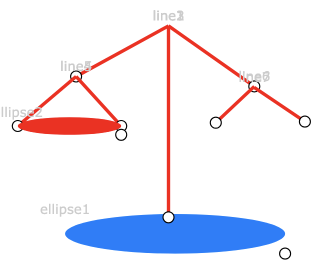

18. Refactor 


```
main = 
let *middle_line_x = 300 in
let *middle_line_y1 = 189 in
let *left_line_x2 = 216 in 
let *left_line_y2 = 235 in
let *left_twoline2_y = 280 in
let *left_ellipse_cx = 210 in
let *ellipse_rx = 47 in 
let *ellipse_ry = 8 in
let *right_line_x2 = 378 in 
let *right_line_y2 = 244 in
let *right_twoline2_y = 290 in
[
  ellipse { 0, 211, 306, 378, 100, 18} 
, line { 0, 0, const *middle_line_x, const *middle_line_y1, const *middle_line_x, 363}
, line { 0, 0, const *middle_line_x, const *middle_line_y1, const *left_line_x2, const *left_line_y2}
, line { 0, 0, const *middle_line_x, const *middle_line_y1, *right_line_x2, *right_line_y2}
, line { 0, 0, const *left_line_x2, const *left_line_y2, const (*left_ellipse_cx-*ellipse_rx), const *left_twoline2_y}
, line { 0, 0, const *left_line_x2, const *left_line_y2, const (*left_ellipse_cx+*ellipse_rx), const *left_twoline2_y}
, ellipse { 0, 0, const *left_ellipse_cx, const *left_twoline2_y, const *ellipse_rx, const *ellipse_ry}
, line { 0, 0, const *right_line_x2, const *right_line_y2, 343, const *right_twoline2_y}
, line { 0, 0, const *right_line_x2, const *right_line_y2, 413, const *right_twoline2_y}];
```


19. Draw the right ellipse. 

```
main = 
let *middle_line_x = 300 in
let *middle_line_y1 = 189 in
let *left_line_x2 = 216 in 
let *left_line_y2 = 235 in
let *left_twoline2_y = 280 in
let *left_ellipse_cx = 210 in
let *ellipse_rx = 47 in 
let *ellipse_ry = 8 in
let *right_line_x2 = 378 in 
let *right_line_y2 = 244 in
let *right_twoline2_y = 290 in
[
  ellipse { 0, 211, 306, 378, 100, 18} 
, line { 0, 0, const *middle_line_x, const *middle_line_y1, const *middle_line_x, 363}
, line { 0, 0, const *middle_line_x, const *middle_line_y1, const *left_line_x2, const *left_line_y2}
, line { 0, 0, const *middle_line_x, const *middle_line_y1, *right_line_x2, *right_line_y2}
, line { 0, 0, const *left_line_x2, const *left_line_y2, const (*left_ellipse_cx-*ellipse_rx), const *left_twoline2_y}
, line { 0, 0, const *left_line_x2, const *left_line_y2, const (*left_ellipse_cx+*ellipse_rx), const *left_twoline2_y}
, ellipse { 0, 0, const *left_ellipse_cx, const *left_twoline2_y, const *ellipse_rx, const *ellipse_ry}
, line { 0, 0, const *right_line_x2, const *right_line_y2, 343, const *right_twoline2_y}
, line { 0, 0, const *right_line_x2, const *right_line_y2, 413, const *right_twoline2_y}, ellipse { 0, 0, 382, 293, 50, 7}];
```

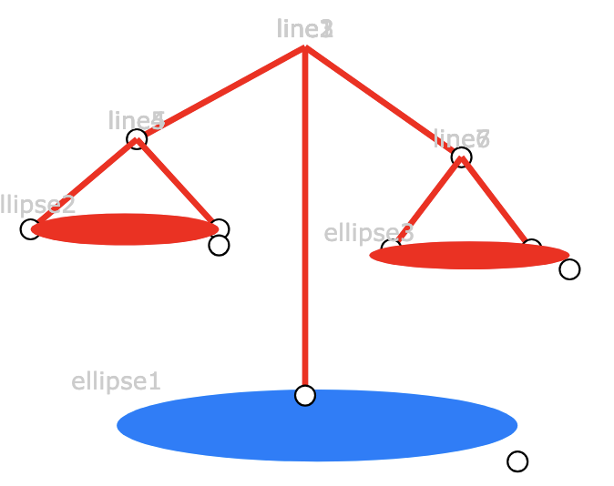


20. Refactor


```
main = 
let *middle_line_x = 300 in
let *middle_line_y1 = 189 in
let *middle_line_y2 = 363 in
let *left_line_x2 = 216 in 
let *left_line_y2 = 235 in
let *left_twoline2_y = 280 in
let *right_line_x2 = 378 in 
let *right_line_y2 = 244 in
let *right_twoline2_y = 295 in
let *left_ellipse_cx = 210 in
let *right_ellipse_cx = 375 in
let *ellipse_rx = 47 in 
let *ellipse_ry = 8 in
[
  ellipse { 0, 211, const *middle_line_x, const *middle_line_y2, 100, 18} 
, line { 0, 0, const *middle_line_x, const *middle_line_y1, const *middle_line_x, const *middle_line_y2}
, line { 0, 0, const *middle_line_x, const *middle_line_y1, const *left_line_x2, const *left_line_y2}
, line { 0, 0, const *middle_line_x, const *middle_line_y1, const *right_line_x2, const *right_line_y2}
, line { 0, 0, const *left_line_x2, const *left_line_y2, const (*left_ellipse_cx-*ellipse_rx), const *left_twoline2_y}
, line { 0, 0, const *left_line_x2, const *left_line_y2, const (*left_ellipse_cx+*ellipse_rx), const *left_twoline2_y}
, ellipse { 0, 0, const *left_ellipse_cx, const *left_twoline2_y, const *ellipse_rx, const *ellipse_ry}
, line { 0, 0, const *right_line_x2, const *right_line_y2, const (*right_ellipse_cx-*ellipse_rx), const *right_twoline2_y}
, line { 0, 0, const *right_line_x2, const *right_line_y2, const (*right_ellipse_cx+*ellipse_rx), const *right_twoline2_y}
, ellipse { 0, 0, const *right_ellipse_cx, const *right_twoline2_y, const *ellipse_rx, const *ellipse_ry}
];
```

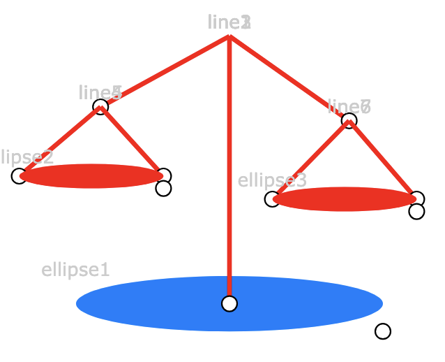