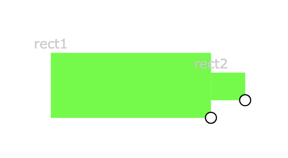

## Steps for buiding the Battery 

1. Draw Body of the Battery 
```
main = [rect { 0, 120, 119, 146, 178, 76}];
```


2. Draw front of the battery, and drag it to align with the body. 

```
main = [
  rect { 0, 120, 119, 146, 178, 76}
, rect { 0, 120, 296, 167, 29, 38}
];
```


3. Refactor: Build the relationship between two rectangles. 

```
main = 
let *rect1_x= 119 in
let *rect1_width= 178 in
let *rect1_y= 146 in
let *rect1_height= 76 in
let *rect2_height= 48 in
let *rect1_fill= 120 in
[ 
  rect {  0 
        , const *rect1_fill
        , const *rect1_x
        , const *rect1_y
        , const *rect1_width
        , const *rect1_height}
, rect { 0
        , const *rect1_fill
        , const (*rect1_x+*rect1_width)
        , const (*rect1_y+(*rect1_height-*rect2_height)*0.5)
        , 26
        , const *rect2_height}
];
```

